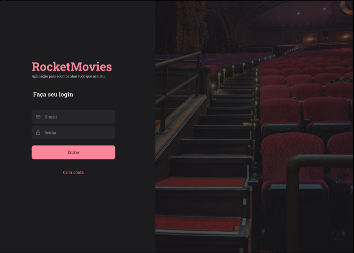

# Uso do React

### Essa tarefa faz parte do curso Explorer da [Rocketseat](https://www.rocketseat.com.br).

Nessa atividade foi abordada a criação do front-end em React.js;

## 🔖 Layout 

O figma do projeto está disponível nesse [Link](<https://www.figma.com/file/r19npdgPqel1gnza265dOY/RocketMovies-(Copy)?type=design&node-id=0-1&mode=design&t=bovwIaXZRufKX5iD-0>).

